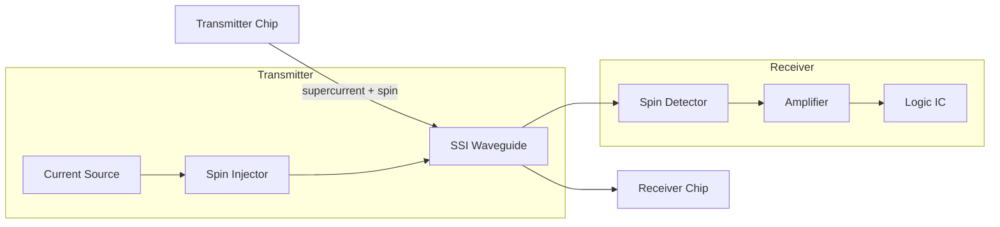
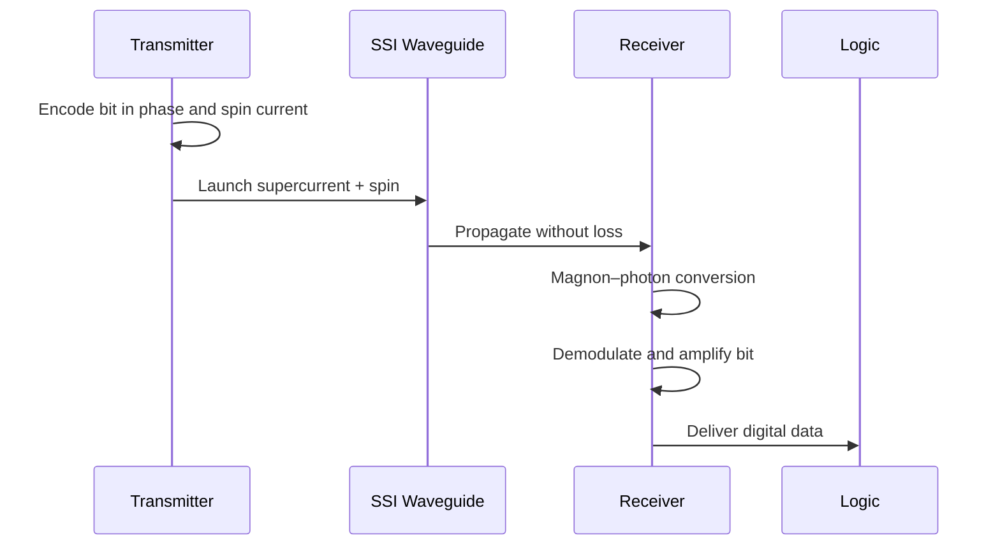

**Superconducting Spintronics Interconnects: Lossless Magnetic Data Lanes Between Cryo-Chips**

---

## Abstract

We introduce **Superconducting Spintronics Interconnects (SSI)**: hybrid transmission lines that carry spin-polarized currents in a superconducting environment for ultralow-loss, high-bandwidth on‑chip and chip-to-chip communication at cryogenic temperatures. By combining superconducting waveguides with spintronic materials, SSI offers magnetic data channels with minimal dissipation and picosecond latency.

## 1. Introduction

Cryo‑electronics (quantum processors, superconducting logic) demands interconnects that preserve signal integrity at millikelvin to kelvin temperatures. Conventional metal lines exhibit resistive losses and crosstalk. We propose **SSI** to realize:

* **Lossless Transmission:** zero Ohmic loss via superconductors
* **Spin-based Signaling:** immunity to electromagnetic interference
* **Cryo-compatibility:** seamless integration with dilution refrigerators

**Keywords:** superconductivity, spintronics, magnonics, cryogenic interconnect, Josephson spin valve

---

## 2. Unique Concept

1. **Superconducting Waveguide Core:** NbTi or NbN microstrip guides carrying spin-polarized supercurrents.
2. **Spin Injector/Detector:** ferromagnetic insulator (e.g. yttrium iron garnet, YIG) interfaced via spin Hall effect layers (Pt)
3. **Magnon–Polariton Coupling:** coherent transfer between spin waves (magnons) and superconducting microwave photons.
4. **Josephson Spin Valve Junctions:** gateable spin filters providing logic-level modulation.

---

## 3. System Architecture



---

## 4. Theoretical Principles

### 4.1 Superconducting Spin Transport

* **Spin-polarized supercurrent** through a ferromagnet in proximity:
  $I_s = I_c \sin\phi \; ,$
  where *φ* is the superconducting phase difference.
* **Usadel equations** for diffusive S–F–S junctions:
  $\frac{D}{2} \nabla (\hat{G}\nabla \hat{G}) + i[\epsilon \hat{\tau}_3 + \hat{h},\hat{G}] = 0 ,$
  with Green’s function *Ĝ*, exchange field *ĥ*, diffusion constant *D*.

### 4.2 Magnon–Photon Coupling

* **Hamiltonian:**
  $H = \hbar \omega_m m^\dagger m + \hbar \omega_{ph} a^\dagger a + \hbar g_{mp}(a m^\dagger + a^\dagger m),$
  where *ω\_m*, *ω\_ph* are magnon and photon frequencies, *g\_mp* coupling.
* **Strong coupling criterion:**
  $g_{mp} > \frac{\kappa + \gamma}{2} ,$
  with photon loss *κ* and magnon damping *γ*.

### 4.3 Josephson Spin Valve Dynamics

* **Critical current modulation:**
  $I_c(θ) = I_{c0} \bigl|\cos\tfrac{θ}{2}\bigr| ,$
  *θ* relative magnetization angle in S–F–F–S junction.

---

## 5. Control & Logic

1. **Magnetic Biasing:** On-chip coils tune ferromagnetic state.
2. **Phase Encoding:** Data encoded in superconducting phase *φ* and magnon population.
3. **Demodulation:** Homodyne detection of microwave photons post-coupling yields digital bits.

---

## 6. Fabrication & Assembly

1. **Substrate:** Sapphire or silicon with superconducting film (NbN) by sputtering.
2. **Ferromagnetic Layers:** YIG grown by pulsed laser deposition, patterned via e-beam lithography.
3. **Spin Hall Layers:** Pt thin film (5 nm) for injection/detection.
4. **Waveguide Patterning:** Photolithography + reactive-ion etching.
5. **Josephson Junctions:** Nb–AlOx–Nb trilayer junctions with integrated ferromagnet.

---

## 7. Operation Workflow



---

## 8. Size & Form Factor

| Component             | Dimensions (mm)           |
| --------------------- | ------------------------- |
| SSI Waveguide (strip) | 0.5 (width) × 0.2 (thick) |
| Transmitter Module    | 5 × 5 × 0.5               |
| Receiver Module       | 5 × 5 × 0.5               |
| Control Electronics   | 100 × 50 × 10             |

**Figure:** Cross-sectional schematic:

```
   ┌────────────────────┐
   │   NbN superconduct. │
   │   strip            │
   │ █ YIG (5 nm) █     │
   │  Pt (5 nm)         │
   └────────────────────┘
```

---

## 9. Applications

* **Quantum Processor Interconnects:** linking qubit modules
* **Superconducting Logic Chips:** SFQ/RSFQ circuit data buses
* **Cryogenic Sensor Arrays:** multiplexed readout of spin-resonant sensors

---

## 10. Advantages Over Conventional Interconnects

* **Zero Ohmic Loss:** superconducting conduction
* **Low Crosstalk:** spin-based signaling decouples from EM modes
* **High Bandwidth:** terabit/s per lane via GHz coupling
* **Cryo-Native:** operates at mK–4 K without performance degradation

---

## 11. Conclusion

SSI merges superconductivity and spintronics to deliver lossless, high-speed magnetic data lanes for next-generation cryogenic electronics, offering a transformative advance over resistive or purely photonic interconnects.

---

## References

1. J. W. A. Robinson, J. D. S. Witt, and M. G. Blamire. (2010). Controlled injection of spin-triplet supercurrents into a strong ferromagnet. *Science*, 329(5987), 59–61.
2. Y. Kajiwara, et al. (2010). Transmission of electrical signals by spin-wave interconversion in a magnetic insulator. *Nature*, 464, 262–266.
3. Huebl, H., et al. (2013). High cooperativity in coupled microwave photon and magnon systems. *Physical Review Letters*, 111(12), 127003.
4. Golubev, D. S., & Zaikin, A. D. (2001). Quasiclassical theory of superconductivity in proximity structures. *Physical Review B*, 64(1), 014504.
